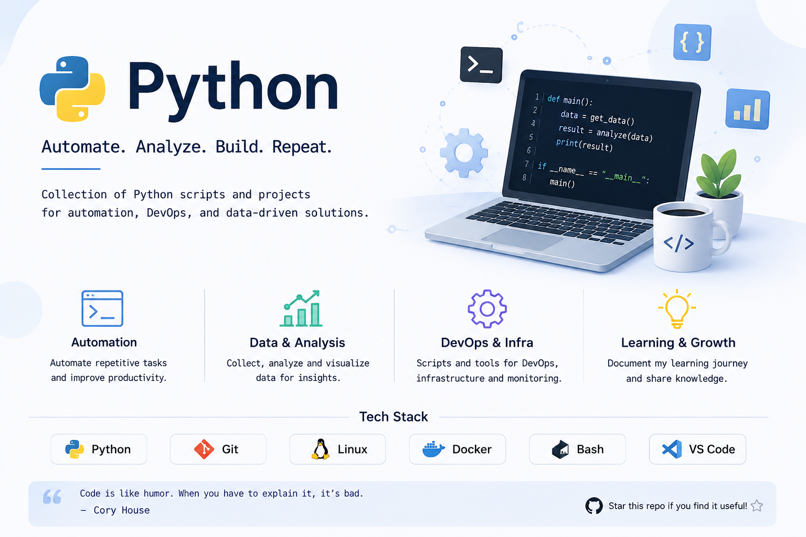

# Python Repository

🔗 Blog: [Python 자료](https://lucky-gun.com/tag/python/)

이 저장소는 Python 학습, 실습, 그리고 실제 운영 환경 구성을 기록한 공간입니다.

## 📂 Repository Structure

### 🧪 Practice (실습 & 실험)
| 디렉토리 | 설명 |링크|
|----------|------|------|
| devops_learning | Kubernetes 클러스터의 자동화를 위해 만든 스크립트 공부 | [링크](https://lucky-gun.com/2026/06/25/work-automation/)
---

### ⚡ index (참고 자료 정리)
| 디렉토리 | 설명 |
|----------|------|
| |  |

---
